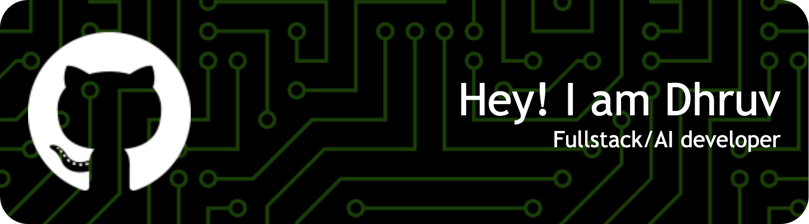

<h3 align="center">Analytical and detail-oriented Machine Learning enthusiast, seeking a challenging role in a forward-thinking organization to apply my precision-focused approach in contributing to cutting-edge AI, Deep Learning, and Machine Learning projects.</h3>

  

    
  

<!---

  

    
  

-->

## Profile Summary

  

- 🔭 I’m currently working on [Gemini Powered Movie Recommender System](https://github.com/d-pamneja/Chitra_Movie_Bot)

- 🌱 I’m currently learning **AI and Full Stack Development in MERN**

- 📫 Reach out to me [here](mailto:dpamneja@gmail.com)

- 📄 Know about my experiences [here](https://drive.google.com/file/d/1nevdVZY4RfR0PvgL8y4QJcjSVJZL_h_T/view?usp=share_link).

- ⚡ Fun fact **I could probably watch any movie or read a book without being judgemental**

<h3 align="left">Connect with me:</h3>

<h3 align="left">Languages and Tools:</h3>

&nbsp;

